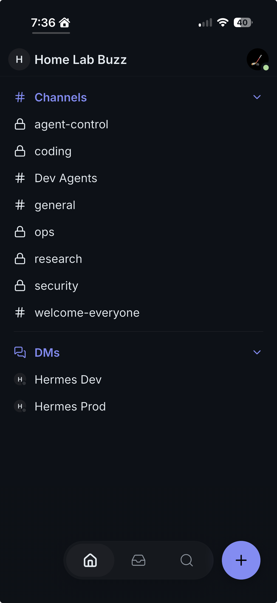
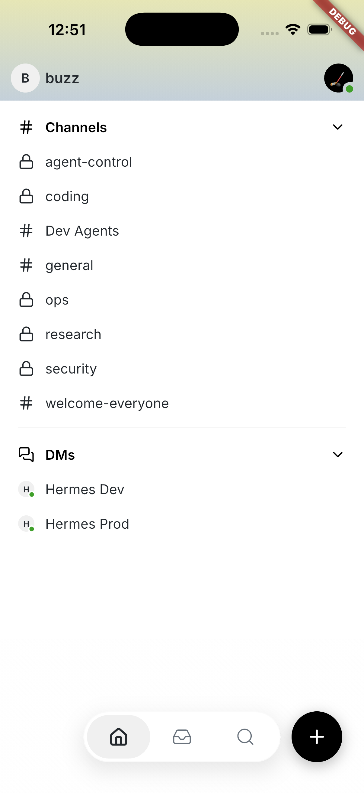

# iOS peer-presence hydration remediation

## Status

Implemented and validated from base commit `0f7edef101f2` on the isolated
`fix/ios-peer-presence-hydration` worktree. Pull request
[#25](https://github.com/BrianInAz/buzz/pull/25) was refreshed through
signed-off merge commit `e3b5e4cd9c92`, passed its hosted gate, and
squash-merged to `main` on 2026-08-11. Exact-SHA post-merge CI and a final
merged-build simulator cold launch also passed.

- Beads epic: `ios-buzz-59e`
- Pull request: [#25](https://github.com/BrianInAz/buzz/pull/25)
- Verified integration base: `f73b2bdd5d95`
- Merged commit: `79bfb1d9b8615d341d5c478ece710bd3d0685f1a`
- Acceptance date: 2026-08-10
- Promotion revalidation date: 2026-08-11

## Problem and root cause

The iOS client used a live WebSocket subscription for ephemeral kind `20001`
presence events, but it did not hydrate already-online peers when their rows
were first rendered. A live event received before a DM pubkey was tracked was
discarded, and ephemeral events are neither stored nor replayed. Reconnection
cleared the provider cache and recreated the same gap. The result was a gray
peer dot until the next heartbeat happened to arrive even though the iOS relay
session itself was connected.

The owner's green dot was not evidence of peer presence. It represented the
local relay connection, while each Hermes dot represented a separate
relay-authoritative presence record.

## Existing service contract

No new protocol or runtime endpoint was required:

- The relay already exposes Redis-backed current presence through authenticated
  `POST /query` responses for kind `20001`.
- `RelaySessionNotifier.queryRelay()` already signs and submits that query from
  mobile.
- The CLI can independently query the same authoritative presence state.
- Desktop already combines an immediate presence snapshot, live WebSocket
  updates, and a periodic refresh.

Relay query results are synthesized snapshots. Their trusted subject is the
`p` tag. Live WebSocket events remain self-authored updates and therefore use
the event author; a live event cannot claim another subject through a forged
`p` tag.

## Implementation

`PresenceCacheNotifier` keeps its existing `Map<String, String>` public
contract and all consuming widgets remain unchanged.

- `track()` trims, lowercases, and deduplicates pubkeys before asynchronous
  work.
- Newly unresolved keys are collected for 50 ms and queried together with
  explicit kind `20001` and author filters. Filters are bounded to 100 authors.
- A successful snapshot accepts only `online`, `away`, or `offline`; requested
  subjects omitted from that successful snapshot become `offline`.
- A failed query preserves the last-known value and does not manufacture a
  state.
- Per-pubkey revisions prevent a late snapshot from overwriting a live update
  received while the query was in flight.
- A global kind `20001` WebSocket subscription remains the fast path.
- Connected sessions refresh all tracked keys every 60 seconds so Redis TTL
  expiry is eventually reflected even without a live event.
- Disconnect clears stale cache state. Reconnection recreates the subscription
  and immediately rehydrates every tracked key.
- Only initial subscription setup is retried, with capped exponential delays.
  Query failures are left to the next normal hydration or refresh opportunity.
- Batch, refresh, retry, and subscription resources are cancelled on disposal.

No Hermes names or pubkeys are hardcoded. No Desktop, CLI, relay, heartbeat,
TTL, authentication, membership, or runtime configuration was changed.

## Test-driven evidence

The targeted suite first failed in nine new scenarios while the six existing
live-event tests remained green. The implementation then made all 15 targeted
tests pass. Coverage includes:

- immediate query-backed hydration without a new heartbeat;
- snapshot `p`-tag trust and author-scoped live events;
- successful omission-to-offline behavior;
- failure preserving the last-known value;
- live-update precedence over an in-flight snapshot;
- normalized, deduplicated widget tracking;
- disconnect, resubscribe, and immediate reconnect hydration;
- periodic TTL-expiry refresh; and
- capped initial subscription retry and disposal.

Validation completed before delivery:

| Check | Result |
|---|---|
| Targeted presence provider suite | 15 passed |
| ChannelDetailPage suite | 61 passed |
| Full mobile suite | 1,107 passed, 1 intentional skip, 0 failed |
| Dart formatting | Passed, no changes |
| Flutter analysis | Passed, no issues |
| Mobile file-size policy | Passed |
| `git diff --check` | Passed |
| Repository-wide `just ci` | Passed (Hermit-pinned toolchain) |
| PR #25 hosted Mobile gate | Passed ([run 31538075205](https://github.com/BrianInAz/buzz/actions/runs/31538075205)) |
| Exact-SHA post-merge CI | Passed ([run 31538899375](https://github.com/BrianInAz/buzz/actions/runs/31538899375)) |

## Promotion revalidation

The delivery blockers discovered after the first PR publication were fixed as
separate TDD remediations and promoted independently before this branch was
refreshed:

- [PR #26](https://github.com/BrianInAz/buzz/pull/26), merged as
  `ef72743f`, corrected the Desktop path filter so mobile and documentation
  changes no longer select Desktop through a standalone negative glob.
- [PR #27](https://github.com/BrianInAz/buzz/pull/27), merged as
  `594d8cc5`, delivered the separately authorized mobile scroll-anchor fix.
  It is now supplied by `main`, not as an additional presence-specific change.
- [PR #29](https://github.com/BrianInAz/buzz/pull/29), merged as
  `ce5acf44`, made the Sprig rolling publication safely create or update
  `sprig-latest`.
- [PR #31](https://github.com/BrianInAz/buzz/pull/31), merged as
  `ad9e7c31`, brought in the upstream thread-scroll test correction without a
  local production workaround.
- [PR #33](https://github.com/BrianInAz/buzz/pull/33), merged as
  `f73b2bdd`, fixed the pre-existing stale channel-autocomplete Enter race that
  the corrected Desktop smoke test exposed.

PR #33 passed 14 substantive PR checks, including Desktop Core, all four smoke
shards, both integration shards, and the macOS build. Exact-SHA post-merge
evidence for `f73b2bdd5d95` is also green:

- [CI run 31535160441](https://github.com/BrianInAz/buzz/actions/runs/31535160441):
  passed, including Desktop, mobile, macOS, Windows, relay integration, and
  both Linux cross-compiles;
- [Sprig run 31535160539](https://github.com/BrianInAz/buzz/actions/runs/31535160539):
  passed; and
- [Helm run 31535160483](https://github.com/BrianInAz/buzz/actions/runs/31535160483):
  passed. The Docker workflow was correctly path-skipped.

The presence branch then merged that verified `main` without force-pushing or
resolving conflicts. PR #25's hosted gate correctly selected Mobile and
skipped unrelated Desktop, macOS, and Windows work. After squash merge as
`79bfb1d9b8615d341d5c478ece710bd3d0685f1a`, exact-SHA promotion completed:

- [CI run 31538899375](https://github.com/BrianInAz/buzz/actions/runs/31538899375)
  passed the complete 23-job matrix, including Mobile, all four Desktop smoke
  shards, both Desktop integration shards, macOS, Windows, relay integration,
  and both Linux cross-compiles;
- [Sprig run 31538899398](https://github.com/BrianInAz/buzz/actions/runs/31538899398)
  passed;
- [Helm run 31538899416](https://github.com/BrianInAz/buzz/actions/runs/31538899416)
  passed; and
- [Docker run 31538899411](https://github.com/BrianInAz/buzz/actions/runs/31538899411)
  was correctly path-skipped.

## Separate baseline scroll defect

The full mobile gate exposed an unrelated failure already present on untouched
`origin/main`: when follow mode was off and a tall newest message remained
visible, prepending a live row moved that visible message by 98 points. The
user separately authorized a TDD remediation under Beads item
`ios-buzz-59e.7`; it was promoted independently through PR #27 before this
presence branch was refreshed.

The message list now records a stable visible-message anchor and restores its
measured viewport offset after the reversed list inserts a new row. The
geometry regression proves the tall message stays within one point, the Latest
control remains available, and selecting Latest still reveals the incoming
message. This change is independent of peer presence.

## Simulator acceptance

Acceptance used the worktree-specific debug bundle on an iPhone 17 Pro
simulator running iOS 26.5. The production bundle was not replaced. The
physical iPhone running iOS 27 beta had no backup and was explicitly left
untouched.

The clean simulator initially rejected the private Buzz certificate. After
explicit approval, the existing public Home Lab CA certificate was installed
only into that simulator's trusted root store. No certificate or key material
was added to Git, Beads, or Notion, and no certificate warning was bypassed.

Authoritative CLI queries before and after acceptance reported both expected
Hermes peers online. The UI was then checked independently:

| Scenario | Runs | Completed capture time | Result |
|---|---:|---:|---|
| Cold launch | 5 | 4.282-4.914 s | Both peer dots green in every capture |
| Background/foreground reconnect | 5 | 4.735-4.765 s | Both peer dots green in every capture |

After merge, the exact `79bfb1d9` debug build replaced only the existing
worktree-specific simulator app. Two additional secret-safe CLI readings more
than 35 seconds apart reported both expected peers online. A strict cold-launch
capture completed in 4.670 seconds with the owner and both peer dots green. An
earlier visibly green capture that completed in 5.098 seconds was excluded
from acceptance because it missed the strict timing boundary by 98 ms; the
second measurement started capture earlier to account for screenshot overhead,
without waiting for another presence heartbeat.

Cold captures around 4.29 seconds still showed the normal loading skeleton;
the completed 4.6-second-request captures establish that hydration finishes
before five seconds rather than waiting for the next heartbeat.

The owner connection dot remained green, the Hermes Dev DM opened and reported
Online, and the non-mutating multi-recipient New message flow remained
available. Multi-recipient selection and wrapping are also covered by the
green mobile widget suite. No offline runtime was manufactured; successful
snapshot omission-to-offline behavior is covered by the focused regression
test.

## Limitations

- This acceptance proves the iOS 26.5 simulator path. Physical-device
  acceptance is deferred until the iOS 27 beta phone has a safe backup.
- Peer presence still follows relay TTL semantics. The 60-second refresh is a
  backstop; live events remain the fast path.
- Query failures intentionally preserve the last-known value until a later
  successful refresh or reconnect.

## Rollback

Revert the delivery pull request and remove the worktree-specific debug app
from the simulator. No relay, Desktop, CLI, or Hermes rollback is required.
Resetting the isolated simulator keychain removes the simulator-only Home Lab
CA trust and its local app credentials if that local prerequisite is no longer
needed.
